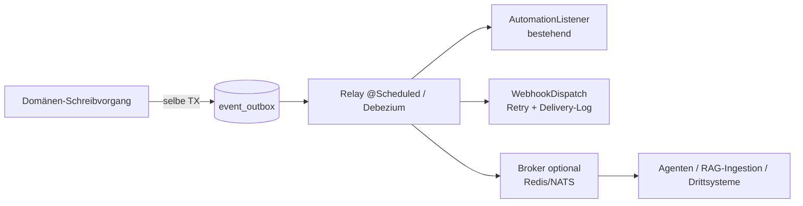

# Architektur-Analyse: KI-Readiness & infrastrukturelle Transformation

Status: konsolidierte Analyse, code-reviewt · Datum: 2026-09-05
Betrachtungsgegenstand: `api/`, `mcp/`, Datenmodell, Automation-Engine, Telemetrie
Auftrag: **keine Feature-Vorschläge**, sondern infrastrukturelle/architektonische
Transformationspotenziale für Erweiterbarkeit, Zukunftssicherheit und KI-Anwendungsfälle
(Predictive Maintenance, autonome Agenten, RAG).

---

## 0. Wie dieses Dokument entstanden ist (und warum man ihm trauen kann)

Es führt **zwei unabhängig erstellte Architektur-Analysen** derselben Codebasis zusammen und
legt eine **Review-Schicht** darüber: die strittigen oder neu behaupteten Fakten der jeweils
anderen Analyse wurden gegen den Code geprüft, bevor sie übernommen wurden. Aussagen, die von
**beiden** Analysen unabhängig gefunden wurden, sind mit ⊕ markiert — sie haben die höchste
Konfidenz. Der Verifikationslog steht in [Anhang A](#anhang-a--verifikationslog).

Die Analyse ist an den bestehenden Konzeptdokumenten ausgerichtet und widerspricht ihnen nicht,
sondern verlängert sie: [`automation-engine.md`](automation-engine.md),
[`workflow-engine-konzept.md`](workflow-engine-konzept.md),
[`mcp-server-konzept.md`](mcp-server-konzept.md), [`ki-meldungs-triage.md`](ki-meldungs-triage.md),
[`reporting.md`](reporting.md).

---

## 1. Executive Summary

Das System besitzt **zwei bemerkenswert diszipliniert gebaute „KI-ready-Inseln"**:

- die **Automation-Engine** (`api/.../automation/**`): Hibernate-Flush-Capture → Post-Commit-
  Publish → metadatengetriebene Regelauswertung mit `correlationId`, Kaskadentiefe-Guard und
  persistentem Run-Log. Erweiterungspunkte (`OperandResolver`, `ActionHandler`) rendern die UI
  selbst.
- den **MCP-Server** (`mcp/src/**`): zustandsloser Proxy, der die OpenAPI-Spec zur Laufzeit lädt,
  stabile Tool-Namen aus Methode+Pfad bildet, Read/Write ehrlich klassifiziert, Fehler strukturiert
  übersetzt und jeden Aufruf auditiert.

Beide folgen bereits dem richtigen Paradigma. **Das Verbindungsgewebe zwischen ihnen ist jedoch
noch UI-/prozesszentriert** und blockiert genau die Anschlussszenarien, für die die Inseln gebaut
wurden. Der rote Faden aller Befunde: **nach innen exzellent, nach außen blind** — an drei Grenzen.

1. **Die JVM-Grenze (Event-Driven).** Der interne Ereignisstrom ist verlustbehaftet: kein Outbox,
   ein JVM-Crash zwischen Commit und Async-Task verliert das Ereignis ⊕. Die semantischen Trigger
   (`APPROVED`, `CLOSED`, …) existieren als Mechanismus, haben aber **null Publisher**
   (`LIVE_SEMANTIC_TRIGGERS = Set.of()`) ⊕. Parallel dazu 22 handverdrahtete Webhook-Stellen mit
   erneut handgerechneten Field-Diffs — die Duplizierung, die die Capture-Pipeline eigentlich
   beseitigt — Fire-and-Forget über ein `RestTemplate` ohne Timeout, ohne Retry, ohne Delivery-Log
   und ohne `AFTER_COMMIT`-Kopplung ⊕. Kein Broker, kein durabler Strom.

2. **Die semantische Datengrenze.** ~30 Enum-Felder liegen als **Java-Ordinals in `SMALLINT`**
   (kein `@Enumerated` → Default `ORDINAL`) ⊕; kein Volltext-Substrat (nur `unaccent LIKE`), kein
   `pgvector`/`tsvector`, keine Delete-Tombstones, nur `WorkOrder` unter Envers ⊕. Dabei existiert
   mit den `rpt_*`-Views bereits die semantische Normalisierungsschicht, die niemand vektorisiert.

3. **Die Telemetrie-/Feedback-Grenze.** Kein `logback`-Config, kein JSON-Logging, kein MDC, keine
   Metriken/Tracing (kein Micrometer/Prometheus/OTel) ⊕; der API-Healthcheck war nie grün.
   Gleichzeitig persistiert die Triage (`RequestQualification`) bereits ein **gelabeltes KI-Dataset**
   (Vorschlag → menschliche Entscheidung), das mangels Auswertungs-View ungenutzt bleibt ⊕.

**Kernbefund:** Der höchste Hebel liegt nicht in neuen Features, sondern in der **Vereinheitlichung**
— ein durabler Event-Strom als Rückgrat, ein semantisches Datenfundament und eine durchgängige
Audit-/Feedback-Spur. Die Substanz dafür (Capture-Pipeline, `rpt_*`-Views, Qualification-Tabellen)
existiert bereits; sie muss durabel gemacht, semantisch gehoben und aggregierbar gemacht werden.

---

## 2. Zehn Infrastruktur-Cases, geordnet nach den fünf Säulen

| Säule | Cases |
|---|---|
| **I. Event-Driven Architecture** | E1 Outbox-Rückgrat · E2 Semantische Events & Transaktions-Entkopplung |
| **II. Semantic Data & Context Readiness** | D1 Enum-/ID-Fundament · D2 RAG-/Semantik-Schicht · D3 Durable Historie & Zeitreihen |
| **III. Agentic Interoperability** | A1 MCP-Schreibpfad & agentische Workflows · A2 Agenten-Identität & API-Kontrakt |
| **IV. Extensibility & Dynamic Rules Engine** | X1 Konfigurierbare Status-Maschine · X2 Notification-Routing & SLA/Eskalation |
| **V. Telemetrie & KI-Feedback-Loops** | T1 Strukturierte Telemetrie & Feedback-Loops |

---

### Säule I — Entkopplung & Ereignissteuerung

#### Case E1 — Transactional Outbox als Rückgrat eines einheitlichen Domain-Event-Stroms

**Ist-Zustand & Engpass.** Die Capture-Pipeline sammelt Änderungen zur Flush-Zeit in einem
ThreadLocal (`automation/capture/TransactionChangeCollector`) und publiziert sie nach Commit —
**in-memory**. Ein Crash zwischen Commit und Async-Ausführung verliert das Ereignis dauerhaft;
ebenso eine Executor-Ablehnung (Default-Pool 3/3/Queue 11, `AbortPolicy`). Es gibt **kein Outbox
und keinen Broker** (Kafka/Rabbit/Redis: null). Webhooks sind ein **parallel gepflegtes
Zweitsystem**: 22 Dispatch-Stellen bauen individuelle Payloads und Diffs
(`WorkOrderService.detectPatchDTOChangedFields` + `detectChangedFieldsFromEntity` — dieselbe Logik,
die Hibernate generisch liefert); Versand über ein inline `new RestTemplate()` **ohne Timeout, ohne
Retry, ohne Delivery-Log**, `@Async` aus der Transaktion heraus und damit **potenziell vor dem
Commit** (der Konsument 404-t auf die referenzierte ID). Die Webhook-Taxonomie (`WebhookEvent`, 21
Werte, 4 nie dispatcht) ist von der Automation-Taxonomie getrennt — ein neues Domänen-Event muss
**zweimal** verdrahtet werden.

**Infrastruktureller Lösungsansatz.**
1. Eine `event_outbox`-Tabelle, in derselben `TransactionSynchronization` geschrieben statt direkt
   publiziert — der natürliche Ersatz für die `CommittedEntityChange`-Naht, die das Design bereits
   dafür vorbereitet hat.
2. Ein Relay (Spring `@Scheduled` oder Debezium auf der Outbox) verteilt an (a) die bestehenden
   In-JVM-`AutomationListener` und (b) einen refaktorierten `WebhookDispatchService` als **zweiten
   Event-Konsumenten** mit generischem Diff, Retry mit Backoff und persistenter `webhook_delivery`-
   Historie (Status, Latenz, Antwortcode). Das ist exakt die in
   [`workflow-engine-konzept.md §4.2`](workflow-engine-konzept.md) dokumentierte „Phase 2".
3. Damit werden die 22 Call-Sites zu **Rückbauten**, nicht zu Erweiterungen. Später ist ein Broker
   (Redis Streams/NATS JetStream — leichter als Kafka, da heute keiner existiert) anzuhängen, ohne
   Services anzufassen.

Fork-Ausrichtung: Outbox + Delivery-Log sind neue Tabellen/Dateien und kollidieren beim
Monats-Sync praktisch nicht.

**Zukunftswert & KI-Enabling.** At-least-once-Delivery ist die Voraussetzung für alles, was
asynchron andocken soll: die RAG-Ingestion (D2), Predictive-Maintenance-Modelle mit vollständiger
Ereignishistorie (D3), Drittsysteme und künftige **Agenten-Subscriptions** (MCP-Notifications, A1).
Der Webhook wird vom Best-Effort-Feuer zu einem auditierbaren, wiederholbaren Integrationskanal.



---

#### Case E2 — Semantische Domänen-Events publizieren & Kerntransaktionen entkoppeln

**Ist-Zustand & Engpass.** Die Engine kennt semantische ChangeTypes (`APPROVED`, `REJECTED`,
`CLOSED`), aber **nichts published sie** (`LIVE_SEMANTIC_TRIGGERS` ist leer ⊕). Stattdessen tragen
einzelne Methoden große Fan-outs in einer Transaktion: `RequestService.approve` löst inline
WO-Erstellung, Webhook, In-App-Notifications an ein **hartkodiertes `LIMITED_ADMIN`-Publikum** und
synchronen Mail-Bau aus (verifiziert, Z. 372–411); dasselbe Muster in
`WorkOrderService.changeStatus` (PM-Reschedule, Labor-Stops, Downtime-Kaskade, Admin-Notifications,
Requester-Mail). Der Zählerstand-Alarm ist **Controller-Logik** (`ReadingController`): Schwellwert,
WO-Erstellung und Webhook synchron im HTTP-Request. Dazu die Koexistenz **zweier Regel-Engines**
(alter `WorkflowService` inline, neue Automation-Engine default-off).

**Infrastruktureller Lösungsansatz.**
1. Das dokumentierte „Rezept 2b" umsetzen: `EntityChangedEvent.root(...)` mit semantischem
   ChangeType an den drei Stellen (Request approve/cancel, WO changeStatus, PO approve) publizieren
   und `LIVE_SEMANTIC_TRIGGERS` befüllen — kleiner Codeumfang, schaltet vorhandene Engine-Fähigkeiten
   frei.
2. Fan-out-Side-Effects aus den Kerntransaktionen in `@TransactionalEventListener(AFTER_COMMIT)`-
   Handler bzw. Automation-Actions verschieben; die Kern-Persistenz bleibt transaktional, Mail/
   Notification/Webhook/PM-Reschedule werden Konsumenten.
3. Den Meter-Trigger aus dem Controller in einen Event/Handler heben.
4. Mittelfristig die Alt-`Workflow*`-Engine auf die neue migrieren — **eine** Trigger-Maschine
   statt zwei (siehe Koexistenz-Begründung in [`workflow-engine-konzept.md §4.1`](workflow-engine-konzept.md);
   die Migration ist der bewusste spätere Schritt, nicht die Panik von heute).

**Zukunftswert & KI-Enabling.** Semantische Events sind die „Sprache", die ein Agent versteht und
erzeugt: „REQUEST_APPROVED → WO created" wird beobachtbar, regelbasiert subsequenzierbar und — über
E1 — an Agenten streambar. Zugleich löst es die strukturelle Schwäche, dass jede neue Logik
(Eskalation, Berichte, KI-Analysen) in bestehende Service-Transaktionen eingreifen müsste.

---

### Säule II — Semantic Data & Context Readiness

#### Case D1 — Semantisches Datenfundament: Enum-Ordinals und stabile Identitäten

**Ist-Zustand & Engpass.** ~30 Enum-Felder haben kein `@Enumerated` und liegen daher als
**Java-Ordinals in `SMALLINT`** (`2026_01_10_..._enums_type.xml`; verifiziert: nur 13 `@Enumerated`
in 7 Dateien) ⊕. Die `rpt_*`-Views übersetzen sie per handgeschriebenem `CASE` mit der Warnung
„Declaration Order, append-only" — nirgends erzwungen. Folgen: ein falscher Enum-Filterwert matcht
still nichts (statt zu fehlern; vgl. CLAUDE.md „Adding a list filter"), jede Export-/KI-Pipeline
dupliziert die Mapping-Tabelle, und ein **eingefügter** (statt angehängter) Enum-Wert korruptiert
historische Daten unbemerkt. Dazu sind IDs nur pro-Tabelle stabil (`id=42` ist über Entitätstypen
mehrdeutig), `customId` nur company-scoped — global stabile Schlüssel für Graph-Nodes/Vektor-
Metadaten fehlen.

**Infrastruktureller Lösungsansatz.** Einmalige Migration der verbleibenden Felder auf
`@Enumerated(EnumType.STRING)` + `SMALLINT→VARCHAR` (Liquibase, ordinal→Name per `CASE`,
append-only-Disziplin hält die Übersetzung trivial). Für `rpt_*` und MCP folgen daraus echte Labels
statt Ordinal-CASEs. Parallel eine optionale `public_uuid`-Spalte oder die verbindliche
Export-Konvention `(entity_type, id)`. Die Enum-Registry, die der MCP-Server bereits als
`cmms://enums` ausliefert, wird damit zur **einzigen Wahrheit** statt eines Workarounds.

**Zukunftswert & KI-Enabling.** Der Data-Integrity-Blocker Nr. 1, von beiden Analysen unabhängig
gefunden. Semantische Werte machen jeden Export selbstbeschreibend (Embedding-Metadaten,
Graph-Edge-Labels, LLM-Kontext), eliminieren eine ganze Klasse stiller Fehler in Agenten-Filtern
und lösen die Konsumenten-Kopplung an die Java-Deklarationsreihenfolge auf. Stabile IDs sind
Voraussetzung für idempotente Sync-Pipelines (Vektor-Upserts, Graph-Upserts, Tombstone-Handling).

---

#### Case D2 — RAG-/Semantik-Schicht: von den `rpt_*`-Views über Change-Feed zu Embeddings & Graph

**Ist-Zustand & Engpass.** Das relationale Modell ist tatsächlich gut graphförmig (Asset↔Location/
Part/Vendor/User/Meter, WO↔Asset/Request/PM/Comments/Tasks, typisierte WO↔WO-Kanten via `Relation`),
und das Freitextwissen ist auf wenige Spalten konzentriert (WO `title`/`description`/`feedback`,
`Comment.content`, `Task`-Werte, Asset/Part-`description`). Aber es fehlt jede Abstraktion, die daraus
**abfragefähige Dokumente** macht: kein `tsvector`/`pg_trgm`, kein `pgvector`, kein
Volltext-Endpoint (nur `unaccent LIKE`) ⊕, keine Delete-Tombstones (harte CASCADE-Deletes →
Dangling-Nodes im Index), EAV-Werte als locale-abhängige Strings, Hierarchien **nur aufwärts**
modelliert (`Asset.parentAsset @ManyToOne`, keine `children`-Collection, keine Pfad-Spalte → kein
Recursive-CTE-Substrat), Attachments in MinIO ohne Textextraktion. Der `AssetMatcher` ist eine
bewusst gesetzte, austauschbare Naht (heute nur `LexicalAssetMatcher`/`lexical-v1`).

**Infrastruktureller Lösungsansatz.** Die vorhandenen `rpt_work_order`/`rpt_asset`/
`rpt_custom_field_value`-Views sind ein fertiges, gepflegtes Staging (Enum-Labels, FK-Auflösung,
EAV→JSONB-Pivot). Darauf aufsetzen:
- **(a) Chunk-View** „ein WO-Lebenszyklus = ein Dokument" (Beschreibung + Kommentare +
  Task-Ergebnisse + Feedback + Asset-Kontextpfad), sprachgetaggt.
- **(b) `tsvector`-Generated-Columns + GIN** als lexikalisches Hybrid-Substrat, perspektivisch
  **`pgvector`** in derselben Postgres-Instanz (keine neue Infrastruktur) — implementiert als
  `EmbeddingAssetMatcher` **hinter dem bestehenden `AssetMatcher`-Interface**, der Triage-Vertrag
  (Matcher schreibt nie, Mensch entscheidet, Engine-Name an jeder Zeile) trägt das ohne
  Endpunkt-Änderung.
- **(c) Change-Feed** aus E1 (Outbox als CDC-Quelle der eigenen Tabellen — kein zweites CDC-System)
  inklusive Tombstones für Löschungen.
- **(d)** Attachment-Textextraktion (PDF/OCR) mit Rückverlinkung über `File` + `work_order_files`;
  OCR aufs Typenschild speist zusätzlich den Bezeichner-Pfad der Triage (der stärkste Match-Hebel,
  siehe [`ki-meldungs-triage.md §6`](ki-meldungs-triage.md)).
- **(e)** Recursive-CTE/Closure-Table für die Hierarchie und ein **Graph-Export/Nachbarschafts-
  Read-Modell** als MCP-Resource `cmms://asset/{id}/context` — fällt aus derselben Schicht ab.

**Zukunftswert & KI-Enabling.** RAG über die Wartungshistorie ist der Kern-KI-Use-Case eines CMMS
(„was war schon einmal an dieser Anlage, was hat geholfen?"). Die Staging-Schicht macht ihn
reproduzierbar statt zu Einmal-Skripten; Hybrid-Suche (lexikalisch + semantisch) bedient Agenten
(MCP-Tool `search_knowledge`) und Menschen gleichzeitig. Der Knowledge-Graph-Export (Assets als
Nodes, WOs/Relations als Edges) und die Kontext-Zusammenstellung für Agenten fallen mit ab.

---

#### Case D3 — Durable Änderungshistorie & Zeitreihen (die Zeitachse für Predictive Maintenance)

**Ist-Zustand & Engpass.** Für PdM braucht man Zeitreihen von Zuständen — und genau die verwirft das
System: **Envers auditiert ausschließlich `WorkOrder`** ⊕; Asset, Part, Meter haben keine
feldgenaue Historie (der Statusverlauf einer Anlage, die Bestandsentwicklung eines Teils sind nicht
rekonstruierbar). Paradox: Die Automation-Capture **sieht** jede dieser Änderungen, persistiert
aber keine. `Reading` ist ein Row-per-Value-Modell mit `double`-Wert und **ohne eigenen Zeitstempel**
außer dem geerbten `createdAt`, ohne Aggregations-/Präzisionsspalten, ohne Index-Tuning — für
Sensordatenmengen ungeeignet.

**Infrastruktureller Lösungsansatz.**
1. **Die Outbox aus E1 ist zugleich die durable Änderungshistorie** für alle erfassten Entitäten —
   statt Envers breit auszurollen, den ohnehin erfassten `EntityChangedEvent`-Strom als Zeitachse
   persistieren. Ein Bauwerk, zwei Zwecke.
2. `Reading` als echte Zeitreihe behandeln: expliziter indizierter Zeitstempel, Aggregations-
   Rollups; bei wachsendem Volumen TimescaleDB-Hypertable (Postgres-Extension, kein Systemwechsel).

**Zukunftswert & KI-Enabling.** Die Trainings- und Feature-Grundlage für Ausfallvorhersage: „diese
Pumpe zum vierten Mal in sechs Monaten" (der Investitionsfall-Hebel aus der Triage) wird erst mit
durabler Zustandshistorie berechenbar. Ohne Zeitachse ist Predictive Maintenance nicht schwer —
es ist unmöglich.

---

### Säule III — Agentic Interoperability & Tool Expansion

#### Case A1 — MCP-Schreibpfad: Kuratierung der agentischen Workflows (+ Push, org-Resources)

**Ist-Zustand & Engpass.** Von ~30 kuratierten Tools sind es **2 mutierende Writes**
(`change_work_order_status`, `create_meter_reading`); Such-/Analytics-POSTs sind als read-only
klassifiziert ⊕. Die eigentlichen Agenten-Workflows existieren nur als generierte, unbeschriebene
Tools oder gar nicht: Request-Freigabe (`PATCH /requests/{id}/approve` — der Kern des Triage-Use-
Cases), der mehrstufige **WO-Abschluss** (Status + Signatur/Feedback + Checklist-Tasks + Labor +
Teile), Kommentare, Parts-Verbuchung, Purchase Orders. Datei-Upload ist **systemisch unmöglich**
(API deklariert Binärdaten als Query-Params, im MCP-Design bewusst ausgeschlossen — aber ein echter
FM-Use-Case). Keine Bulk-Operationen (N Calls gegen ein Per-Key-Ratelimit), keine unternehmens-
bezogenen Resources (nur Spec-Derivate `cmms://enums`, `cmms://schema`) ⊕. Der Server ist
**Pull-only** — ein Agent kann nicht geweckt werden. Antworten >60k werden mitten im JSON
abgeschnitten.

**Infrastruktureller Lösungsansatz.**
- **(a) Kuratierte Komposit-Endpoints** für die zwei Kern-Workflows: `POST /work-orders/{id}/complete`
  (atomar: Status, Signatur, Feedback, Task-Werte, optional Labor/Parts) und Approval-Semantik für
  Requests — als dünne neue Controller hinter den bestehenden Services (fork-freundlich: neue
  Dateien), im MCP mit ehrlicher State-Machine-Beschreibung.
- **(b)** File-Upload als `multipart/form-data` nachrüsten und im MCP als Tool mit Base64-Argument
  freischalten.
- **(c)** Bulk-Endpoints (create/patch-Arrays) für Agenten-Batchoperationen.
- **(d)** Org-scoped Resources (`cmms://locations/tree`, `cmms://asset-categories`, `cmms://asset/{id}/context`)
  statt nur Spec-Derivate — sie brauchen den authentifizierten Aufruf und schließen damit den offenen
  „Schritt-0-Beweis" aus [`mcp-server-konzept.md §12.3`](mcp-server-konzept.md) ab.
- **(e)** Push: ein MCP-Notification-Kanal, gespeist aus dem Broker von E1 — der Agent wird geweckt
  statt zu pollen. `semantic_search`-Tool auf D2.
- **(f)** Server-seitiges Paging statt JSON-Truncation: abgeschnittene Antworten durch strukturierte
  „mehr verfügbar"-Signale ersetzen.

**Zukunftswert & KI-Enabling.** Ein Agent kann dann den vollen Lebenszyklus autonom oder
human-in-the-loop abwickeln — Voraussetzung für den im Konzept angepeilten Stufe-2-Assistenten und
für autonome Dispositions-Agenten. Komposit-Tools senken zugleich Fehlerrisiko (weniger Schritte,
klarere Semantik) und Token-Kosten pro Operation.

---

#### Case A2 — Agenten-Identität & API-Kontrakt: Scoped Keys, Agent-Audit, Fehlersemantik

**Ist-Zustand & Engpass.** Ein API-Key **impersoniert vollständig einen User** (`ApiKeyAuthFilter`:
einzige Autorität = `roleType`; verifiziert: kein Scope-/Read-only-Begriff im Filter) — kein
„read-only-Key"-Primitiv, keine Scopes, kein Own- vs. Delegated-Modell. Die Policy-Landschaft ist
gespalten: License-Gate und Permission-Fail antworten beide `403 "Access denied"` (der MCP-Server
kompensiert mit einem Hint), fachliche Fehler kommen als **nackte 500** mit `ex.getMessage()` durch
und werden vom MCP-Server heuristisch als „business refusal" klassifiziert. Das Backend **loggt
API-Key-Traffic nicht** (nur `lastUsedAt`, 5-Min-Cache) — im CMMS ist nicht nachvollziehbar, welche
Aktion über einen Agenten lief.

**Infrastruktureller Lösungsansatz.**
- **(a) Scopes pro ApiKey** (`read`, `write:work-orders`, `approve` …) als neue Spalte + Enforcement;
  die MCP-Profile (`readonly`/`core`) bilden das bereits klientseitig ab — jetzt serverseitig
  verbindlich machen.
- **(b)** Eine `agent_action`-Audit-Tabelle: ein Interceptor schreibt pro API-Key-Request
  Methode, Pfad, Status, Latenz, Key-Fingerprint, `correlationId` — das persistente Backend-Pendant
  zur flüchtigen MCP-stderr-Zeile, im Produkt abfragbar.
- **(c)** Ein einheitlicher Error-Contract (`{kind, code, message, retryable}`) für Filter, Handler
  und Rate-Limiter; der MCP-Server ersetzt seine 500-Text-Heuristik durch echte Semantik.

**Zukunftswert & KI-Enabling.** Scopes sind die Voraussetzung, Agenten überhaupt Schreibrechte zu
geben, **ohne** ihnen die volle User-Identität zu überlassen (Least-Privilege für autonome Systeme).
Die Agent-Audit-Spur macht KI-Aktionen governable (Wer-was-wann, rollback-fähig über E1/Envers) und
liefert — mit T1 kombiniert — die Trace-Grundlage für Tool-Use-Evaluation. **Diese Governance sollte
stehen, bevor A1 mit Schreibrechten produktiv geht.**

---

### Säule IV — Extensibility & Dynamic Rules Engine

#### Case X1 — Konfigurierbare Status-Maschine für Work Orders

**Ist-Zustand & Engpass.** `Status` ist ein **freies Enum ohne Transitionsmodell** (verifiziert:
`OPEN/IN_PROGRESS/ON_HOLD/COMPLETE`, keine `canTransition`-Logik) — jeder Status kann auf jeden
gesetzt werden. Alle Completion-Semantiken stecken in einer ~100-Zeilen-Methode
(`WorkOrderService.changeStatus`): Signatur-Pflicht + Feature-Gate inline, Downtime-Auto-Stop mit
Cross-WO-Query, PM-Reschedule, Labor-Stops, Admin-Notifications, Alt-Workflow-Run, App-Review-Zähler,
Requester-Mail. Ein neuer Status (z. B. „WARTET_AUF_LIEFERANT") oder kundenspezifische
Completion-Regeln sind ohne Codeänderung nicht ausdrückbar — und die neue Engine kann Completion
nicht beobachten (kein `WORK_ORDER_CLOSED`-Event, siehe E2).

**Infrastruktureller Lösungsansatz.** Transition-Matrix als Daten (Status × Event → Zielstatus +
Action-Pipeline), implementiert nach dem vorhandenen `ActionHandler`-Muster der Automation-Engine:
Completion-Checks, Downtime-Stop, Labor-Stop, PM-Reschedule, Notifications werden Pipeline-Handler;
die Matrix ist pro Company konfigurierbar. `changeStatus` schrumpft auf: Transition validieren →
persistieren → Events publishen (E2) → Pipeline ausführen.

**Zukunftswert & KI-Enabling.** Prozessvariabilität ohne Code (FM-Kunden haben unterschiedliche
Lebenszyklen) und — KI-relevant — ein **explizites, maschinenlesbares Prozessmodell**: ein Agent
fragt erlaubte Transitionen ab (`cmms://workflows`-Resource) statt sie aus Konventionen zu raten;
die Engine kann auf jede Transition regeln; die Triage-„Verbindlichkeitsprüfung"
([`ki-meldungs-triage.md §6.3`](ki-meldungs-triage.md), ausdrücklich ein Regelwerk-, kein
KI-Problem) findet hier ihren Ablageort.

---

#### Case X2 — Notification-Routing & SLA/Eskalation als Konfiguration (Zeit-Trigger)

**Ist-Zustand & Engpass.** Jede Notification hat Audience-Query, Message-Key und Thymeleaf-Datei
**in der Aufrufstelle** hartkodiert (verifiziert an `RequestService`: „alle `LIMITED_ADMIN`"). „Bei
Prioritätswechsel das Team des Requesters benachrichtigen" = neue Call-Station + Template. **SLA
existiert als Konzept nicht** (kein Escalation-Code); die einzige Fristkonstante „urgent = 48h" ist
zweimal kopiert (`WorkOrderService.countUrgent`, `WorkloadService`), Einzelmahnung ist der
PM-Notification-Job. Dabei ist die **fristbasierte Triggerebene** im Engine-Konzept ausdrücklich als
„Stufe 2, bereits Eskalation" empfohlen — und **Quartz mit JDBC-JobStore liegt durabel bereit**,
ungenutzt für diesen Zweck.

**Infrastruktureller Lösungsansatz.**
- **(a) Routing-Tabelle** Event → Audience-Resolver (`role:X`, `team:X`, `requester`, `primaryUser`,
  `assignees`) → Kanäle → Template-Key, als Erweiterung des `NotifyHandler` (das Konzept skizziert
  `"recipients": ["team:12"]` bereits).
- **(b) SLA-Policy-Tabelle** (Priorität/Kategorie/Anlagenklasse → Zielstunden, Reminder-Offsets) +
  fristbasierte Quartz-Trigger, die Eskalations-Events erzeugen; `countUrgent`/Workload lesen die
  Policy statt der Konstante.

**Zukunftswert & KI-Enabling.** Notification-Logik wird tier-/kundenspezifisch konfigurierbar statt
entwickelt; ein SLA-Breach wird ein Ereignis (E1/E2), das Regeln, Webhooks und Agenten („eskaliere
an Dispositions-Agent") konsumieren können. Reaktions-/Bearbeitungszeiten sind zudem erste Labels
für Predictive-Maintenance-Modelle (D3). Der Zeit-Trigger erschließt die Klasse „nichts ist
passiert", die kein reaktives Ereignis liefern kann.

---

### Säule V — Telemetrie & KI-Feedback-Loops

#### Case T1 — Strukturierte Telemetrie, Observability-Hygiene & KI-Feedback-Loops

**Ist-Zustand & Engpass.** Das Backend hat **kein `logback`-Config**, kein JSON-Logging, kein
MDC/Correlation-ID, keine Micrometer-Registry (Actuator nur Health), nginx `access_log off`
(verifiziert), Docker-Logs ohne Rotation; der API-Healthcheck war **nie grün** (Security-Permit
fehlt, CLAUDE.md Open Items) ⊕. Die zwei guten strukturierten Audit-Inseln (`automation_run`;
MCP-JSON-on-stderr, metadata-only) sind unverbunden. Das größte verschenkte Asset ist die
**Triage**: `RequestQualification`/`RequestQualificationCandidate` persistieren bereits Vorschläge
mit Score, Rang, Engine und menschlicher Entscheidung (`PENDING/APPLIED/REJECTED/SUPERSEDED`) — ein
fertiges, gelabeltes Dataset — aber die Doku konstatiert selbst „Keine Auswertung": keine
Acceptance@1-Metrik, keine Latenzerfassung, keine Negativbeispiele unter Schwelle, Listener-Fehler
werden stillgeschluckt ⊕.

**Infrastruktureller Lösungsansatz.**
- **(a) Hygiene-Welle:** `logback` mit JSON-Encoder, MDC-Filter (`correlationId`, `tenant`, `actor`
  — durch alle Async-Executors propagieren, auch den Automation-Executor), Micrometer +
  `/actuator/prometheus`, der Ein-Zeilen-Healthcheck-Permit-Fix, Log-Rotation im Compose-File. Die
  `sessionId` des MCP-Servers als Request-Header durchreichen → End-to-End-Korrelation einer
  Agenten-Transaktion.
- **(b)** MCP-Audit-Zeilen zusätzlich persistieren (via HTTP-Hook in die `agent_action`-Tabelle aus
  A2); optional, bewusst scoped, ein Opt-in für Argument-/Response-Capture pro Session — der Rohstoff
  für Tool-Use-Datasets.
- **(c)** Triage-Auswertung: eine `rpt_triage_quality`-View (Acceptance@1, Rejection-Grund-
  Verteilung, Latenz pro Engine) — die Tabellen sind da, es fehlt nur die Aggregation (die zwei in
  [`ki-meldungs-triage.md §6`](ki-meldungs-triage.md) geforderten Zahlen).

**Zukunftswert & KI-Enabling.** (a) macht das System überhaupt observability-fähig (und beendet das
„permanent-rot trainiert Ignoranz"-Signal). (b) schaltet den Feedback-Loop frei, der die Triage von
`lexical-v1` zu embedding-basiertem Matching (D2) **messbar** vergleichen lässt — ohne Metrik ist
jedes KI-Upgrade ein Blindflug; dasselbe Gerüst trägt später LLM-Antwortqualität und
Agenten-Evaluation. (c) liefert die ersten echten Fine-Tuning-/Eval-Datasets aus dem Betrieb statt
aus Synthetic Data.

---

## 3. Priorisierungs-Matrix

Bewertung: **Impact** = Zukunftssicherheit/KI-Enabling · **Aufwand** kalibriert an der Realität
dieses Forks (Ein-Personen-Kontext, Monats-Sync-Kosten, „eigene Änderungen günstig halten").
●○○ = niedrig, ●●● = hoch.

| Case | Säule | Impact | Aufwand | Abhängig von | Einordnung |
|---|---|---|---|---|---|
| **E2** Semantische Events publizieren | I | ●●● | ●○○ | — | **Sofort-Quick-Win** — 3 Stellen + `LIVE_SEMANTIC_TRIGGERS`, schaltet vorhandene Engine-Fähigkeit frei |
| **D1** Enum→STRING + stabile IDs | II | ●●● | ●●○ | — | **Quick Win, strategisch** — mechanische Migration, größter Data-Integrity-Blocker |
| **T1a** Telemetrie-Hygiene + Healthcheck-Fix | V | ●●○ | ●○○ | — | Quick Win, Fundament für alles Operative |
| **T1c** `rpt_triage_quality`-View | V | ●●○ | ●○○ | — | Quick Win — nur eine View auf existierenden Tabellen |
| **E1** Transactional Outbox + Webhook-Konsument | I | ●●● | ●●○ | — | **Strategischer Kern** — Basis für E1-Abnehmer; 22 Call-Sites werden Rückbauten |
| **A2** Scoped Keys + Agent-Audit + Error-Contract | III | ●●○ | ●●○ | (E1) | Governance-Voraussetzung, **bevor** A1 mit Schreibrechten produktiv geht |
| **A1** MCP-Schreibpfad (Complete/Approve, Upload, Bulk, Push) | III | ●●● | ●●○ | A2, (E1) | **Der** Agenten-Enabler; Komposit-Endpoints sind dünne neue Controller |
| **X2** SLA/Eskalation + Notification-Routing | IV | ●●○ | ●●○ | E2 | Hoher fachlicher Nutzen, nutzt Engine-Muster + Quartz; inkrementell |
| **D3** Durable Historie & Zeitreihen | II | ●●● | ●●○ | E1 | Teilt sich das Outbox-Bauwerk; die PdM-Zeitachse |
| **X1** Konfigurierbare Status-Maschine | IV | ●●○ | ●●● | E2 | Hohe Wirkung, größter Refaktorings-Umfang; nach E2 deutlich einfacher |
| **D2** RAG-/Semantik-Schicht (tsvector/pgvector, Graph, Tombstones) | II | ●●● | ●●● | E1, D1 | Größter KI-Nutzen, aber zuverlässig erst **nach** E1 (Deletes) und D1 (Werte); `rpt_`-Basis macht den Einstieg inkrementell |

### Empfohlene Wellen

```
Welle 1 — Fundament (Quick Wins, überwiegend additiv, konfliktarm im Sync)
   E2  →  D1  →  T1a + T1c

Welle 2 — Event-Rückgrat & Governance
   E1  →  A2

Welle 3 — Agenten-Offensive
   A1  (+ kuratierte MCP-Expansion)   ‖   X2  (erste "Stufe 2"-Nutzung der Engine)

Welle 4 — KI-Datenschicht auf stabilem Fundament
   D3  (Outbox→Historie)  →  D2  (Ingestion/Embeddings/Graph)
   X1  als kontinuierlicher Refaktorings-Track, sobald semantische Events (E2) liegen
```

**Übergreifender Vorzug dieses Fahrplans:** Fast alle Bausteine sind **additiv** (neue Tabellen,
Handler, Views, Endpoints) statt editschwer in Upstream-Dateien — das hält die Divergenzkosten des
Monats-Syncs niedrig und folgt damit der wichtigsten Eigen-Architekturvorgabe dieses Forks.

**Der verbindende Gedanke:** **E1 (Outbox) ist das Rückgrat.** Es macht den bereits erfassten
Ereignisstrom durabel — und liefert in einem Zug die PdM-Zeitachse (D3), die Agenten-Weckung (A1),
den RAG-Change-Feed (D2) und die Replay-Fähigkeit für Trainingsdaten. E2, D1 und T1 sind die
günstigen, hochwirksamen Vorarbeiten, die parallel dazu sofort Wert schaffen.

---

## Anhang A — Verifikationslog

Gegen den Code geprüfte, potenziell strittige Behauptungen (Stand 2026-09-05):

| Behauptung | Ergebnis | Beleg |
|---|---|---|
| Semantische Trigger haben keinen Publisher | **bestätigt** | `AutomationMetaService:60` `LIVE_SEMANTIC_TRIGGERS = Set.of()`; `ChangeType` enthält `CLOSED/APPROVED/REJECTED` |
| Gros der Enums liegt als Ordinal-`SMALLINT` | **bestätigt** | nur 13 `@Enumerated` in 7 Modelldateien; `2026_01_10_..._enums_type.xml` |
| `Status` ohne Transitionsmodell | **bestätigt** | `enums/Status.java` — nur Werteliste, keine `canTransition`-Logik |
| API-Key ohne Scope/Read-only | **bestätigt** | `ApiKeyAuthFilter` — kein Scope-/`readOnly`-Begriff |
| `RequestService.approve` als Inline-Fan-out mit hartkodiertem Publikum | **bestätigt** | `RequestService.java:372–411` (WO-Erstellung, Webhook, `LIMITED_ADMIN`-Filter, Mail) |
| nginx protokolliert keinen Zugriff | **bestätigt** | `docker/nginx/nginx.conf:40` `access_log off;` |
| Kein Broker, kein Outbox | **bestätigt** | keine Kafka/Rabbit/Redis-Abhängigkeit; kein `event_outbox` |
| Webhook `@Async`, `RestTemplate` ohne Timeout/Retry/Delivery-Log, 22 Call-Sites | **bestätigt** | `WebhookDispatchService`; 22 `dispatchWebhook`-Aufrufe in 9 Dateien |
| Envers nur `WorkOrder` | **bestätigt** | `@Audited` nur auf `WorkOrder`; `reporting.md:301` |
| Keine Metriken/Tracing, Healthcheck nie grün | **bestätigt** | keine Micrometer/Prometheus/OTel-Abhängigkeit; CLAUDE.md Open Items |
| Triage-Feedback ohne Auswertung | **bestätigt** | `RequestQualification` (Status/`chosen_asset_id`/`ordinal`); kein `rpt_`-View |

⊕-markierte Aussagen im Text wurden von zwei unabhängigen Analysen gefunden.
