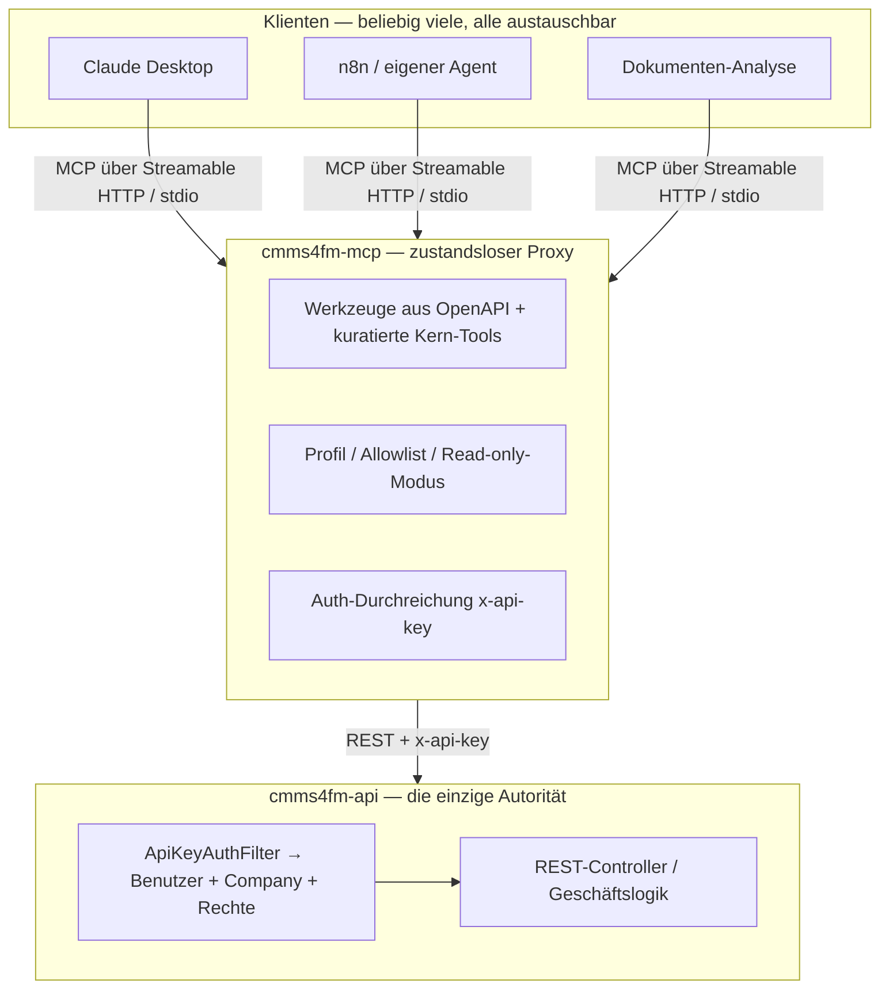

# MCP-Server als universelles Addon für cmms4fm

Status: **umgesetzt** — Stufe 0 und Stufe 1 stehen als `mcp/`. Was der Bau am Konzept
korrigiert hat und was noch offen ist, steht in §12; die Betriebsanleitung in
[`mcp/README.md`](../mcp/README.md).
Datum: 2026-09-04 (Konzept und Umsetzung)
Bezogener Code: `mcp/**` (der Server), `api/` (REST-Oberfläche, `/v3/api-docs/atlas-cmms`,
`ApiKeyAuthFilter`), `docker/nginx/**`, `docker-compose.yml`, `.github/workflows/deploy.yml`,
`.github/workflows/tests.yml`

---

## 1. Was hier gebaut werden soll — und was ausdrücklich nicht

Nicht ein KI-Feature. Eine **Werkzeuggrenze**.

Der MCP-Server ist die *eine, stabile, LLM-unabhängige* Schnittstelle, über die beliebige
KI-Anwendungen mit dem CMMS arbeiten: ein Claude-Desktop-Agent, ein n8n-Flow, ein eigenes
Skript, ein gehosteter Agent, ein Dokumenten-Analyse-Flow. Alle diese sind
**Klienten** des Servers, keine Bestandteile. Der Wert steckt nicht in einem einzelnen Use Case,
sondern darin, dass ein neuer Use Case den Server *nicht anfasst*: er nutzt vorhandene Werkzeuge,
oder er bekommt genau ein neues — und nie eine Änderung an fünf Stellen.

Das ist die ganze These: **der Server ist das Substrat, die Use Cases wachsen darüber.** Wenn das
gelingt, ist „universal" kein Anspruch, sondern ein Betriebszustand — jede weitere KI-Idee ist
eine Konfiguration am Klienten, kein Projekt am Server.

### Ziele

1. **Ein Werkzeugvertrag über der gesamten REST-Oberfläche.** Was das CMMS als API kann, kann der
   MCP-Server als Tool anbieten — ohne dass jede Fähigkeit von Hand nachgezogen wird.
2. **Neue Fähigkeit = Konfiguration, nicht Code.** Ein neuer Endpunkt im CMMS erscheint durch
   Neugenerierung; freigeschaltet wird er über ein Profil. Kein handgepflegter Tool-Spiegel.
3. **Klient-Unabhängigkeit.** Derselbe Server bedient Claude Desktop, n8n, eigene Agenten und
   HTTP-Aufrufer. Ein Transport für lokal (stdio), einer für entfernt (Streamable HTTP).
4. **Der Server eskaliert nie Rechte.** Er ist ein zustandsloser Proxy; die einzige Autorität für
   Berechtigung und Mandantentrennung bleibt das CMMS. Der Server kann nie mehr, als der
   vorgelegte Schlüssel darf.
5. **Sicher gegen die Use Cases, die ihn füttern.** Lesen ist harmlos, Schreiben nicht. Der
   Server macht den Unterschied maschinenlesbar und pro Deployment abschaltbar.

### Nicht-Ziele (bewusst)

- **Keine Geschäftslogik.** Der Server rechnet nichts, entscheidet nichts, validiert keine
  Fachregeln. Alles das lebt im CMMS. Ein Tool, das mehr tut als „ruf diesen Endpunkt sauber
  auf", ist eine Ausnahme mit Begründung (§7), nicht die Regel.
- **Kein LLM im Server.** Der Server ruft kein Sprachmodell. Wo ein Modell läuft und welche Daten
  es sieht, entscheidet der Klient. Das trennt die Datenabfluss-Frage sauber ab: **der Server
  selbst sendet nie etwas nach außen** — er beantwortet nur Tool-Aufrufe.
- **Kein zweites Berechtigungssystem.** Keine eigenen Rollen, keine eigene Mandantenlogik. Der
  `x-api-key`-Pfad des CMMS ist die Autorität.
- **Kein Ersatz der REST-API.** Wer direkt gegen `/api/` programmieren will, tut das weiter. Der
  MCP-Server ist der Weg für *agentische* Nutzung, nicht der einzige Weg.
- **Nicht nativ im Backend.** Begründung in §3. Der Server entsteht *neben* `api/`, nicht darin.

---

## 2. Ausgangslage im Code — worauf aufgebaut wird

Vier Dinge existieren bereits und machen den Server zu einem kleinen Vorhaben statt zu einem
großen:

**Das CMMS veröffentlicht seine OpenAPI-Spezifikation.** `/v3/api-docs/**` (und `/swagger-ui`)
sind in `WebSecurityConfig` freigeschaltet — die Spec selbst liegt aber **nicht** unter
`/v3/api-docs`, sondern unter der Gruppen-URL `/v3/api-docs/atlas-cmms`, weil
`springdoc.enable-default-api-docs` in `application.yml` auf `false` steht. Der nackte Pfad
antwortet 404, was genau wie „API ist weg" aussieht (§12.1).

Diese Spec ist die Maschinenlesbarkeit, aus der die Werkzeuge entstehen — der Grund, warum
„universal" nicht bedeutet, hundert Tools von Hand zu schreiben.

**Es gibt einen fertigen externen Authentifizierungspfad.** `ApiKeyAuthFilter` nimmt den Header
`x-api-key`, hasht ihn, lädt den zugehörigen Benutzer und setzt einen ganz normalen
`UsernamePasswordAuthenticationToken`. Der Aufrufer ist damit **als dieser Benutzer**
authentifiziert und bekommt genau dessen Rechte und dessen Company — nicht mehr, nicht weniger.
Der MCP-Server braucht also keine eigene Identität; er reicht einen Schlüssel durch.

**Der Schlüssel deckt die ganze authentifizierte Oberfläche ab.** `WebSecurityConfig` endet mit
`anyRequest().authenticated()`. Ein API-Key erreicht dieselben Controller wie die Web-App,
gefiltert durch die Rolle und die Berechtigungen seines Benutzers. Das ist zugleich die Chance
(alles ist erreichbar) und das Risiko (§5): der Schlüssel ist mächtig, der Zuschnitt passiert
über den *Benutzer*, dem er gehört.

**Reife Generatoren existieren.** `openapi-mcp-generator` (TypeScript) erzeugt aus einer
OpenAPI-3-Spec einen eigenständigen MCP-Server mit stdio-, SSE- und Streamable-HTTP-Transport,
Zod-Validierung und Env-basierter Auth und proxyt die Aufrufe an die Original-REST-API. Der Bau
beginnt also nicht bei null, sondern bei „generieren, dann kuratieren".

Und die Voraussetzung, die zuerst zu schaffen ist:

**API-Keys hängen an einem Flag.** `ApiKeyAuthFilter` verlangt Lizenz-Entitlement *und*
Plan-Feature `API_ACCESS`; beide öffnet `SELF_HOSTED_UNLOCK_PREMIUM=true`, das per Default
`false` ist (siehe `CLAUDE.md`, „Self-hosting premium unlock"). Auf der laufenden Instanz ist es
**gesetzt** — `GET /api/license/state` meldet `planName: "Self-Hosted (unlocked)"` und
`API_ACCESS` (§12.3). Der „Schritt null" des Konzepts entfällt damit; bleibt: einen Schlüssel
erzeugen und den Pfad einmal von Hand beweisen.

---

## 3. Grundentscheidung: externer, zustandsloser Proxy

Die erste und wichtigste Weiche. Es gibt zwei Wege, MCP an dieses CMMS zu bringen:

**A — nativ im Backend.** `spring-ai-starter-mcp-server-webmvc` in `api/pom.xml`, Tools als
annotierte Beans, ausgeliefert über SSE/HTTP direkt aus Spring. Klingt integriert.

**B — externer Proxy.** Ein eigener kleiner Dienst neben `api/`, generiert aus der OpenAPI-Spec,
authentifiziert per durchgereichtem `x-api-key`, ausgeliefert über Streamable HTTP.

**Gewählt: B.** Nicht aus Vorsicht, sondern aus drei erschlagenden Gründen:

- **Divergenz.** Upstream läuft mit ~11 Commits/Tag und wird monatlich gemergt (`CLAUDE.md`,
  „Keeping in step"). `spring-ai` in `api/pom.xml` plus Tool-Beans im Backend ist neue
  Oberfläche in einer Datei, die *jeden Monat* mitgemergt wird. Ein externer Dienst ist fast nur
  neue Dateien und kollidiert nie — dieselbe Rechnung, aus der die Workflow-Engine als eigenes
  Package entstand.
- **Sicherheitsgrenze.** Der externe Proxy hat *keine eigene Privilegierung*. Er kann strukturell
  nichts, was der vorgelegte Schlüssel nicht darf, weil er nichts anderes tut, als diesen
  Schlüssel weiterzureichen. Ein nativer Server läuft im Prozess mit vollem DB-Zugriff und müsste
  Berechtigung selbst nachbilden — genau die Klasse Fehler, die man nicht will.
- **Klient- und Betriebs-Unabhängigkeit.** Ein separater Dienst wird unabhängig deployt, skaliert
  und abgeschaltet, ohne das API-Image anzufassen. Ein kaputter Generatorlauf legt nicht das CMMS
  lahm.

Native Integration (Weg A) ist damit nicht verboten, aber nachgeordnet: sie ist in §8 als „Stufe
3, nur bei konkretem Grund" geführt und muss sich dann gegen genau diese drei Punkte
rechtfertigen.

---

## 4. Zielarchitektur

### 4.1 Die drei Schichten



Der Server ist eine dünne, zustandslose Schicht: Werkzeuge rein, REST-Aufrufe raus, Antworten
zurück. Kein Zustand zwischen Aufrufen, keine eigene Datenbank, kein Cache mit
Invalidierungsproblem.

### 4.2 Auth-Kette — die zentrale Entscheidung für „universal + sicher"

Der Server hält **keine eigene Identität**. Zwei Betriebsarten, pro Deployment gewählt:

| Modus | Wie | Wann |
|---|---|---|
| **Durchreichung** (empfohlen) | Der Klient legt seinen Schlüssel je MCP-Sitzung vor — über HTTP als `x-api-key`-Header **oder** als `Authorization: Bearer <key>`, je nachdem, was er kann; auf stdio als Env-Variable. Der Server reicht ihn unverändert als `x-api-key` an das CMMS weiter | Mehrere Klienten/Benutzer, weil Identität, Rechte, Company **und Audit** am echten Benutzer hängen |
| **Dienstschlüssel** | Der Server trägt genau einen Schlüssel aus seiner Env | Ein einzelner, vertrauenswürdiger Agent; einfachste Einrichtung |

Beide Male gilt: **das CMMS ist die einzige Instanz, die über Berechtigung und Mandant
entscheidet.** Der Server addiert null Privileg. Wer den Server kompromittiert, gewinnt nichts,
was der vorgelegte Schlüssel nicht ohnehin könnte.

Konsequenz für den Zuschnitt: die schärfste Sicherheitsschraube ist **welcher Benutzer dem
Schlüssel gehört.** Ein Schlüssel, dessen Benutzer nur Leserechte hat, macht den ganzen Server
lesend — ganz ohne Servercode. Das ist die primäre Kontrolle; §5 ergänzt die zweite.

### 4.3 Das Werkzeug-Modell — zwei Schichten

Roh generiert erzeugt die OpenAPI-Spec *ein Tool pro Endpunkt* — hier über hundert. Das erschlägt
das Tool-Budget des Modells und macht die Auswahl schlecht. Deshalb zwei Schichten:

**Schicht 1 — generierte Breite.** Aus `/v3/api-docs` erzeugt, ein Tool je Endpunkt, mit
Zod-Schema aus der Spec. Das ist die Universalität: neuer Endpunkt upstream → neu generieren →
Tool ist da. Aber nicht alles davon ist immer sichtbar.

**Schicht 2 — Kuratierung.** Was der Klient tatsächlich sieht, bestimmt ein **Profil** (Env/
Config): eine Allowlist von Tools plus optionale bessere Beschreibungen für die wichtigen. Ein
paar handverlesene Kern-Tools (`search_assets`, `get_asset_details`, `search_work_orders`, …)
bekommen sorgfältige Beschreibungen; der Rest bleibt hinter einem Profil, das man bei Bedarf
weitet.

```
PROFILE=readonly    → nur GET-Tools
PROFILE=assets      → Anlagen + Standorte + Zähler, lesen und schreiben
PROFILE=full        → alles, was der Schlüssel-Benutzer darf
```

Damit ist „universal" nicht „alles gleichzeitig sichtbar", sondern „alles verfügbar, das
Passende freigeschaltet". Ein neuer Use Case wählt sein Profil, nicht seinen Serverbau.

**Discovery statt Tool-Flut.** Statt jeden Endpunkt als Tool zu zeigen, bietet der Server ein
Meta-Tool (`list_capabilities` / MCP-Resources, §7), über das ein Agent die Oberfläche erkundet
und gezielt Tools anfordert. So bleibt das aktive Tool-Set klein und das Gesamtangebot groß.

### 4.4 Lesen und Schreiben maschinenlesbar trennen

Jedes Tool trägt die MCP-Annotationen `readOnlyHint`, `destructiveHint`, `idempotentHint`,
abgeleitet aus der HTTP-Methode (GET → read-only; DELETE/PUT → destruktiv). Dazu ein
Server-Schalter `READ_ONLY=true`, der jedes schreibende Tool ausblendet, egal welches Profil.

Das ist die Antwort auf die Use Cases, die *nicht vertrauenswürdigen* Input verarbeiten (ein
hochgeladenes PDF, eine E-Mail): ein solcher Klient bekommt ein read-only Profil **und** einen
Schlüssel eines nur-lesenden Benutzers — zwei unabhängige Riegel. Schreibende Wirkung entsteht
dann ausschließlich dort, wo ein Mensch sie im CMMS-Frontend auslöst. Der Server erzwingt das
nicht als Fachregel (das wäre Geschäftslogik, Nicht-Ziel), sondern als *Deployment-Profil*.

### 4.5 Fehler übersetzen, nicht durchreichen

Das CMMS hat bekannte, aussagekräftige Fehlerzustände, die ein Agent unterscheiden können muss —
sonst behandelt er „gerade nicht erreichbar" wie „darf ich nicht" wie „falsche Eingabe". Der
Server mappt sie in strukturierte MCP-Fehler:

| CMMS-Antwort | Bedeutung | MCP-Fehler |
|---|---|---|
| `403` | Rolle/Berechtigung fehlt | „nicht berechtigt" — Agent soll nicht wiederholen |
| `503` | DB/Dienst nicht bereit (siehe `CLAUDE.md`, „Wrong credentials") | „vorübergehend" — Agent darf zurückhaltend wiederholen |
| `500` mit Text | u. a. Nutzungsgrenze als nackte `RuntimeException` (siehe `workflow-engine-konzept.md` §9.1) | „fachlicher Fehlschlag" — Text durchreichen, nicht wiederholen |
| `400` | Validierung | „falsche Eingabe" — Agent soll korrigieren |

Ohne diese Übersetzung wird jeder 500er zu „irgendwas ging schief" und der Agent rät.

---

## 5. Sicherheit

Der Server weitet die Angriffsfläche **nicht** über das hinaus, was `/api/` ohnehin öffentlich
anbietet — es ist derselbe `x-api-key`-Pfad, nur mit MCP davor. Trotzdem gehören fünf Dinge
festgelegt:

1. **Rechte kommen vom Schlüssel-Benutzer, nicht vom Server.** Die primäre Kontrolle ist der
   Zuschnitt dieses Benutzers (§4.2). Für jeden dauerhaften Klienten ein eigener, minimal
   berechtigter Benutzer mit eigenem Schlüssel — nicht ein geteilter Admin-Key.
2. **Read-only als Default für Klienten mit nicht vertrauenswürdigem Input.** Profil *und*
   Schlüssel-Benutzer lesend (§4.4). Prompt-Injection über ein Dokument kann dann nichts
   schreiben, weil kein schreibendes Werkzeug erreichbar ist.
3. **Audit jeder Tool-Nutzung.** Der Server protokolliert je Aufruf: Zeit, welcher Schlüssel
   (gehasht, nie im Klartext), welches Tool, welcher Endpunkt, Ergebnisstatus. Nicht die
   Nutzdaten. Das ist die Antwort auf „wer hat worüber was getan".
4. **Rate-Limit pro Schlüssel.** Ein Agent in einer Schleife darf das CMMS nicht überrollen. Der
   Server begrenzt; das CMMS bleibt geschützt.
5. **Kein Datenabfluss durch den Server.** Er ruft kein Modell und sendet nichts nach außen (§1).
   Ob FM-Kundentexte eine Grenze überschreiten, entscheidet allein der Klient — eine Frage, die
   das Triage-Konzept bewusst offen hält (`ki-meldungs-triage.md` §5) und die hier **nicht**
   stillschweigend mitentschieden wird.

Schlüsselverwaltung: Schlüssel liegen in der Env des Klienten bzw. des Servers, nie im Repo (das
Repo ist öffentlich, `CLAUDE.md`). `ApiKeyService` speichert ohnehin nur den Hash und zeigt den
Klartext genau einmal bei Erzeugung.

---

## 6. Betrieb und Deployment

Ein neuer Dienst, im selben Muster wie die bestehenden. Er lebt als eigenes Verzeichnis `mcp/`
im Repo — wie `mobile/` ein in sich geschlossener Teil, der beim Upstream-Abgleich nie
kollidiert, weil Upstream ihn nicht kennt.

| Aspekt | Festlegung |
|---|---|
| Image | `cmms4fm-mcp`, in CI gebaut (`deploy.yml`), von Coolify gezogen — **nie auf dem Server bauen** (`CLAUDE.md`) |
| Transport | Streamable HTTP (entfernte Klienten), stdio (lokaler Desktop-Klient) |
| Erreichbarkeit | hinter nginx als neue Route `/mcp/` → mcp-Dienst; **Domain nur am nginx** (Coolify-Falle, `CLAUDE.md`) |
| nginx-Config | in das Image gebacken, **kein Datei-Bind-Mount** (Coolify rewritet relative Mounts, `CLAUDE.md`) |
| Env | `CMMS_BASE_URL`, `PROFILE`, `READ_ONLY`, `RATE_LIMIT`, Auth-Modus, optional `SERVICE_API_KEY` |
| Zeilenenden | Entrypoint/Config auf LF pinnen (`.gitattributes`), Alpine nutzt `ash` — keine Bashismen |
| Health | eigener Readiness-Endpunkt; der Dienst ist bereit, sobald er die OpenAPI-Spec geladen hat |
| Voraussetzung | `SELF_HOSTED_UNLOCK_PREMIUM=true` in `docker-compose.yml`, damit `API_ACCESS` offen ist (§2) |

Keine host-seitige Portfreigabe (`ports:`), Coolifys Proxy routet zum Container (`CLAUDE.md`).

Sprache/Werkzeug: **TypeScript** mit dem offiziellen `@modelcontextprotocol/sdk`, Startpunkt
`openapi-mcp-generator` gegen `/v3/api-docs`. Node/TS-Toolchain ist im Repo schon vorhanden
(`frontend/`). Python (`openapi-mcp-codegen`) ist die gleichwertige Alternative, falls der Betrieb
das bevorzugt — die Architektur oben ist sprachneutral.

---

## 7. MCP jenseits von Tools: Resources und Prompts

Tools sind nur ein Drittel von MCP. Für ein *universelles* Addon sind die anderen zwei das, was
„viele Dinge" billig andocken lässt:

- **Resources** — lesbare Daten und Schemata, die der Klient in seinen Kontext zieht, ohne dass
  jeder Zugriff ein Tool-Aufruf ist: die Anlagenklassen dieser Company, die Enum-Werte für
  Priorität/Status, die Liste der Zählerarten. Das entlastet das Tool-Budget (§4.3) und gibt dem
  Agenten Struktur, bevor er handelt.
- **Prompts** — wiederverwendbare Use-Case-Vorlagen, die *auf dem Server* liegen und im Klienten
  als fertige Bausteine erscheinen: „Fasse die Wartungshistorie dieser Anlage zusammen",
  „Gleiche dieses Protokoll gegen die Anlage ab". So wandert ein neuer Use Case als *ein
  Prompt-Eintrag* in den Server, nicht als Code — und alle Klienten haben ihn sofort.

Genau hier zahlt sich die Nicht-Ziel-Disziplin aus: weil der Server keine Geschäftslogik trägt,
sind Prompts reine Kompositionsanweisungen über vorhandene Tools — sie können nichts kaputtmachen,
was die Tools nicht ohnehin dürfen.

---

## 8. Umsetzung in Stufen

### Stufe 0 — Die Kette einmal beweisen (0,5–1 T)

Ziel ist nicht Vollständigkeit, sondern ein durchgehender Beweis, bevor irgendetwas kuratiert
wird.

1. `SELF_HOSTED_UNLOCK_PREMIUM=true` setzen, einen API-Key für einen Testbenutzer erzeugen, den
   `x-api-key`-Pfad einmal mit `curl` gegen `/assets/search` beweisen. Das Flag ist auf der
   laufenden Instanz **bereits gesetzt** (§12.3); offen bleiben Schlüssel und `curl`-Beweis,
   beides nur in der CMMS-Oberfläche zu holen.
2. Server gegen `/v3/api-docs/atlas-cmms` laufen lassen, Streamable HTTP, Auth per
   durchgereichtem Header. **Erledigt**, samt Kuratierung aus Stufe 1.
3. Mit einem echten MCP-Klienten (MCP Inspector oder Claude Desktop) gegen die laufende Instanz
   verbinden und `search_assets` → `get_asset` ausführen. **Offen**, weil dafür der Schlüssel aus
   Schritt 1 nötig ist. Gegen ein CMMS-Double ist genau diese Kette in `mcp/test/e2e.test.ts`
   grün.

Danach wird neu entschieden. Trägt die Kette, folgt:

### Stufe 1 — Kuratierung und Sicherheit (2–3 T)

Profile/Allowlist (§4.3), Read/Write-Annotationen und `READ_ONLY`-Schalter (§4.4),
Fehler-Mapping (§4.5), Audit-Log und Rate-Limit (§5). Eigenes Image `cmms4fm-mcp` in CI,
nginx-Route `/mcp/`, Deployment über Coolify (§6). Ab hier ist der Server produktiv nutzbar und
sicher zugeschnitten.

### Stufe 2 — Anreicherung (nach Bedarf)

MCP-Resources (Anlagenklassen, Enums, Zählerarten), MCP-Prompts als Use-Case-Vorlagen (§7), und
die wenigen kuratierten Kern-Tools mit erstklassigen Beschreibungen. Hier docken die ersten
echten Klienten an — ein Dokumenten-Analyse-Flow etwa als *ein* Konsument unter vielen.
Composite-Tools nur, wo ein Agent eine feste Mehrschrittfolge sonst jedes Mal falsch
zusammensetzt — jedes ist eine begründete Ausnahme vom Nicht-Ziel „keine Logik".

### Stufe 3 — Nativer Server, nur bei konkretem Grund (optional)

`spring-ai-starter-mcp-server-webmvc` im Backend. Kommt nur infrage, wenn ein Bedarf auftaucht,
den der externe Proxy nachweislich nicht deckt (etwa Tools, die auf interne Ereignisse reagieren
müssen, nicht auf REST-Aufrufe). Muss sich dann gegen die drei Gründe aus §3
(Divergenz, Sicherheitsgrenze, Betriebsentkopplung) rechtfertigen — vorher ist es die teurere
Variante ohne Mehrwert.

---

## 9. Entscheidungs-Log

| # | Entscheidung | Verworfene Alternative | Begründung |
|---|---|---|---|
| E1 | **Externer, zustandsloser Proxy** | Nativ `spring-ai` in `api/` | Divergenz (monatlicher Upstream-Merge), Sicherheitsgrenze (kein eigenes Privileg), Betriebsentkopplung. §3 |
| E2 | **Aus OpenAPI generieren, dann kuratieren** | Alle Tools von Hand schreiben; oder alle roh anbieten | Handschreiben skaliert nicht und driftet; alles roh erschlägt das Tool-Budget. Zwei Schichten lösen beides. §4.3 |
| E3 | **Auth durchreichen, Server ohne Identität** | Server hält Admin-Dienstschlüssel | Der Server kann dann nie mehr als der Aufrufer; Rechte und Audit bleiben am echten Benutzer. §4.2 |
| E4 | **Read/Write als Annotation + Deployment-Profil** | Schreibschutz als Fachregel im Server | Schreibschutz gehört ins Deployment (Profil + Schlüssel-Benutzer), nicht in Servercode — sonst wandert Logik in den Proxy. §4.4 |
| E5 | **Der Server ruft kein LLM** | Modellaufruf im Server bündeln | Trennt den Datenabfluss sauber ab; der Server sendet nie nach außen, die Grenzfrage bleibt beim Klienten. §1/§5 |
| E6 | **Eigenes Verzeichnis `mcp/`, eigenes Image** | Ordner unter `api/` oder `frontend/` | Neuer, in sich geschlossener Teil kollidiert beim Sync nie; unabhängig deploybar. §6 |
| E7 | **Streamable HTTP primär, stdio für lokal** | Nur stdio; nur SSE | HTTP bedient entfernte/gehostete Klienten und ist der aktuelle Transport; stdio für den Desktop-Fall. §4.1 |

---

## 10. Risiken

| Risiko | Gegenmaßnahme |
|---|---|
| Tool-Flut aus roher Generierung erschlägt das Modell | Profile/Allowlist, Discovery-Meta-Tool, kuratierte Kern-Tools. §4.3 |
| Prompt-Injection über nicht vertrauenswürdigen Input mit Schreibfolgen | Read-only-Profil **und** nur-lesender Schlüssel-Benutzer; Schreiben nur durch Mensch im Frontend. §4.4/§5 |
| Über-mächtiger geteilter Schlüssel | Pro Klient ein eigener, minimal berechtigter Benutzer; nie ein Admin-Key. §5 |
| API-Key-Pfad ist zu (Premium-Gate) | `SELF_HOSTED_UNLOCK_PREMIUM=true`; als Schritt 0 verankert. §2/§8 |
| Fehler werden undifferenziert zu „ging schief" | Fehler-Mapping 403/503/500/400 → strukturierte MCP-Fehler. §4.5 |
| Generierter Server driftet von der Spec (neue/geänderte Endpunkte) | Neugenerierung in CI gegen `/v3/api-docs`; Profil bestimmt, was davon sichtbar wird. §4.3 |
| Agent in Schleife überrollt das CMMS | Rate-Limit pro Schlüssel im Server. §5 |
| Coolify-Fallen (relative Mounts, Domain je Dienst, keine host-Ports) | Config ins Image, Domain nur am nginx, kein `ports:`. §6, `CLAUDE.md` |
| Datenabfluss über den Klienten | Nicht Sache des Servers; bewusst dem Klienten überlassen und explizit benannt, nicht verdeckt. §1/§5 |

---

## 11. Abgrenzung zu den Nachbarkonzepten

- **[Workflow-Engine](workflow-engine-konzept.md)** ist das Gegenstück nach innen: sie
  automatisiert *innerhalb* des CMMS auf Ereignisse hin. Der MCP-Server öffnet nach *außen* für
  agentische Werkzeugnutzung. Sie überschneiden sich nicht — die eine reagiert auf interne
  Events, der andere beantwortet externe Tool-Aufrufe.
- **[KI-Meldungs-Triage](ki-meldungs-triage.md)** liefert die eine Regel, die dieses Konzept
  übernimmt: nicht vertrauenswürdiger Input darf nichts Schreibendes anstoßen, und die
  Datenabfluss-Frage wird benannt statt stillschweigend entschieden.

---

## 12. Umsetzungsstand (2026-09-04)

Gebaut als `mcp/` — eigenes Verzeichnis, eigenes Image `cmms4fm-mcp`, TypeScript mit dem
offiziellen `@modelcontextprotocol/sdk`, nginx-Route `/mcp`, Tests in
`.github/workflows/tests.yml`. Betrieb, Profile und Konfiguration stehen in
[`mcp/README.md`](../mcp/README.md); hier steht, **was der Bau am Konzept korrigiert hat**. Die
Architektur (E1–E7) hat gehalten, vier Annahmen darunter nicht.

### 12.1 Vier Korrekturen, die das Konzept nicht vorhersehen konnte

**Die Spec liegt nicht unter `/v3/api-docs`.** Sie liegt unter `/v3/api-docs/atlas-cmms`, weil
`enable-default-api-docs: false` gesetzt ist. Der nackte Pfad antwortet 404 — dieselbe Antwort
wie ein totes Backend. Env-Variable `SPEC_GROUP` mit Default `atlas-cmms`, und der Loader hängt
an einen 404 genau diesen Hinweis an.

**`operationId` ist als Tool-Name unbrauchbar — und zwar strukturell.** springdoc benennt nach
der Java-Methode und hängt bei Namensgleichheit einen Scan-Reihenfolge-Zähler an:
`POST /assets/search` heißt `search_15`, `GET /assets/{id}` heißt `getById_39`,
`PATCH /assets/{id}` heißt `patch_40`. Das ist nicht nur unlesbar, sondern **instabil**: ein
zusätzlicher Controller upstream nummeriert unbeteiligte Tools um und bricht damit jede
Klienten-Allowlist, ohne dass sich am Endpunkt etwas geändert hätte. Namen kommen deshalb aus
**Methode + Pfad** (`post_assets_search`, `get_assets_by_id`) — eindeutig per Konstruktion und
nur dann geändert, wenn der Endpunkt sich ändert. Ein Test prüft das gegen die echte Spec.

**Lesen/Schreiben lässt sich in dieser API nicht aus der HTTP-Methode ableiten.** §4.4 leitet
`readOnlyHint` aus der Methode ab (GET liest, DELETE/PUT schreibt) — richtig als Default und an
einer entscheidenden Stelle falsch: **jeder Listen-Endpunkt ist ein POST** mit
`SearchCriteria`-Body, und jede Analytics-Abfrage ebenso. Klassifiziert man die als schreibend,
findet `PROFILE=readonly` nichts mehr — das lesende Deployment wäre nicht sicher, sondern
nutzlos. Die lesenden POST-Formen sind darum eine explizite Liste (`/analytics/*`, `*/search`,
`*/histogram`, `/work-orders/events`); alles andere gilt als schreibend. Der Default-Fehler geht
damit in die richtige Richtung: ein neuer, unbekannter Endpunkt ist zunächst versteckt statt
fälschlich als harmlos gezeigt.

**Kuratierung ist keine Kür, sondern Voraussetzung.** Die Spec beschreibt **6 ihrer 373
Operationen** (fünf Webhook-Endpunkte plus ein Histogramm). Die anderen 367 kommen ohne
`summary` und ohne `description` an. Roh generiert erfährt ein Modell also die HTTP-Methode und
sonst nichts — die Tool-Flut aus §10 ist damit nicht das erste Problem, sondern das zweite.
Rund 30 Kern-Endpunkte haben handgeschriebene Beschreibungen, inklusive der Filter-Semantik
(UND-Verknüpfung aller `filterFields`, `enumName` nur für PRIORITY/STATUS/JS_DATE); der Rest
bekommt eine aus Tag, Methode, Pfad, Parametern und Antwort-DTO synthetisierte Beschreibung,
die auch sagt, dass sie synthetisiert ist.

### 12.2 Wo die Umsetzung über das Konzept hinausgeht

- **Spec zur Laufzeit statt Codegenerierung.** `openapi-mcp-generator` war als Startpunkt
  vorgesehen (§2, §6). Gebaut ist stattdessen ein generischer Server, der die Spec **beim Start
  lädt** und die Tools daraus ableitet — was §6 mit „bereit, sobald er die OpenAPI-Spec geladen
  hat" ohnehin unterstellt. Damit entfällt der Generatorlauf als Drift-Quelle (Risiko-Tabelle,
  letzte Zeile): es gibt keinen generierten Code, der von der Spec abweichen könnte.
  `SPEC_REFRESH_MINUTES` liest ohne Redeploy nach, `SPEC_FILE` ist der Rückfall, wenn die API
  gerade nicht erreichbar ist.
- **Endpunkte, die der Server grundsätzlich nicht anbietet:** `/auth/**`, `/subscriptions/**`,
  `/subscription-plans*`, `/notifications/push-token`. Keine Berechtigungsentscheidung — über
  REST bleiben sie erreichbar, und wer darf, entscheidet weiter das CMMS — sondern Hygiene der
  Werkzeugoberfläche: ein Agent hat nichts damit zu schaffen, Zugangsdaten auszustellen,
  Sitzungen zu beenden oder das Abo zu ändern, und ein Tool dafür wäre nur ein Pfad, den eine
  injizierte Anweisung erreichen kann.
- **Datei-Uploads sind ausgeschlossen, mit genannter Begründung.** `POST /files/upload` und
  `POST /files/upload/request-portal/{uuid}` deklarieren ihre Binärdaten als *Query*-Parameter;
  ein JSON-Tool-Aufruf kann das nicht ausdrücken. Sie verschwinden nicht still, sondern stehen
  mit Grund in `list_capabilities`.
- **Zwei Schemagrenzen, weil die Spec sie erzwingt.** `PreventiveMaintenancePostDTO` inlined
  sich zu ~130 KB, und Entity-DTOs verweisen zyklisch aufeinander. Zyklen werden zu
  untypisierten Objekten, zu große Schemata auf ihre oberste Ebene gekürzt — die vollständige
  Definition bleibt über die Resource `cmms://schema/{name}` lesbar.
- **Profil `core-readonly`** als benannter Default für den Fall aus §4.4/§5.2 (nicht
  vertrauenswürdiger Input): kuratierte Tools, nur lesend. Und `READ_ONLY` schlägt eine
  `TOOLS_ALLOW`-Ausnahme, ist also tatsächlich das letzte Wort.
- **nginx löst den Dienst spät auf.** Ein `upstream`-Block wird beim Start aufgelöst; nginx
  startet mit „host not found in upstream" gar nicht. Ein gestoppter `mcp`-Dienst hätte damit
  die ganze Domain abgeschaltet, Login-Formular inklusive. Eine Variable in `proxy_pass`
  verschiebt die Auflösung auf den Request: `/mcp` antwortet 502, alles andere bedient weiter.

### 12.3 Was geprüft ist — und was noch nicht

**Geprüft, automatisiert:** 56 Tests, in CI (`tests.yml`, Node 22) und im Image-Build (strict
`tsc`). Der größte Teil läuft gegen die **echte Spec** als Fixture, weil genau deren
Eigenheiten das sind, was hier bricht. `mcp/test/e2e.test.ts` fährt einen MCP-Klienten gegen
den Server gegen ein CMMS-Double: Schlüssel-Durchreichung, strukturierte Fehler, verstecktes
Tool bleibt unaufrufbar, Rate-Limit greift, Audit-Zeile enthält weder Schlüssel noch Nutzdaten.
Von Hand nachgefahren: `npm ci` + `npm test` wie in CI, die Build-Schritte des Dockerfiles
einzeln, und der Start des fertigen Builds mit Abfrage von `/healthz`.

**Stufe 0 ist bewiesen (2026-09-05).** Ein API-Key wurde erzeugt, n8n hängt als MCP-Klient an
`https://<domain>/mcp`, und `get_asset` liefert echte Anlagendaten aus dem CMMS zurück. Damit
ist die Kette Klient → MCP → REST → Antwort vollständig belegt, nicht nur gegen ein Double.
Der Rest dieses Abschnitts hält fest, was auf dem Weg dahin nicht stimmte.

**Die Voraussetzung aus §2 ist schon erfüllt.** `GET /api/license/state` ist `permitAll` und
antwortet auf der laufenden Instanz mit `planName: "Self-Hosted (unlocked)"` und `API_ACCESS`
in den Entitlements — `SELF_HOSTED_UNLOCK_PREMIUM=true` ist also gesetzt, und damit sind beide
Hälften des Gates offen (die Plan-Hälfte kommt aus demselben Flag, weil `ApplicationInitializer`
dem FREE-Plan beim Start alle `PlanFeatures` gibt). Der „Schritt null" des Konzepts entfällt
damit. Nützlich als Diagnose: antwortet ein Tool-Aufruf später 403 „Access denied", ist das
zuerst gegen diese URL zu prüfen, bevor man Rechte im CMMS sucht.

**Inzwischen ebenfalls belegt:** der Image-Build (CI baut `cmms4fm-mcp` seit dem ersten Push
auf `main`), das Deployment über Coolify, und der Betrieb hinter nginx unter `/mcp`.

**Was weiterhin offen ist, und warum es zählt:** es existiert genau *ein* API-Key für alle
Klienten. §5.1 verlangt pro dauerhaftem Klienten einen eigenen, minimal berechtigten Benutzer —
das ist die scharfe Kontrolle, das Profil regelt nur Sichtbarkeit. Solange nur gelesen wird,
ist der Schaden begrenzt; **bevor irgendein Klient auf ein schreibendes Profil wechselt, ist
das nachzuholen.**

### 12.4 Erster echter Klient: was dabei brach

n8n (MCP-Client-Node, HTTP Streamable) hat die Kette am 2026-09-05 als erster echter Klient
angefasst — und dabei zwei Dinge gezeigt.

**Nur `x-api-key` zu lesen war zu eng.** Der Node bietet „Bearer Auth" als fertige Option;
damit kommt `Authorization: Bearer <key>` an, und der Server fand keinen Schlüssel. Beide Header
werden jetzt akzeptiert und bedeuten dasselbe: der Token geht ohnehin als `x-api-key` ans CMMS
weiter, gewährt also nichts zusätzlich. Ein Klient, der den einen Header nicht senden kann, ist
kein Angreifer, sondern ein Klient.

**Die Fehlergestalt ist irreführend, und das ist der eigentliche Befund.** Ohne Schlüssel
gelingt die Verbindung, `tools/list` liefert die vollständige Werkzeugliste, und
`list_capabilities` antwortet normal — weil genau dieses eine Tool keinen Schlüssel braucht, es
liest nur den Katalog, den der Server schon hat. Jedes andere Tool antwortet
`unauthenticated`. Das liest sich als „der Server läuft, aber die meisten Tools sind kaputt",
obwohl gar nichts authentifiziert war. Wer das nächste Mal „einige Tools gehen nicht" hört:
zuerst prüfen, ob überhaupt ein Schlüssel ankommt.

**Und ein zweiter Befund, der ohne echten Klienten nicht sichtbar war: die Spec verschweigt
ihre eigenen Defaults.** `SearchCriteria` — der Body jedes Such-Tools — hat in Java echte
Vorgaben (`pageSize = 10`, `pageNum = 0`, `sortField = "id"`, `filterFields = []`), und
springdoc schreibt keine davon ins Schema, auch nicht, dass alle Felder optional sind. Ein
Klient, der brav jedes Feld befüllt, das er sieht, erfindet deshalb Werte: n8n erzeugte
`"field": "string"` und `pageSize: 0`, und das CMMS antwortete
`500 "Page size must not be less than one"` — für einen Aufruf, der mit *weggelassenen*
Feldern funktioniert hätte. Ein Sprachmodell, das denselben Aufruf zusammensetzt, hat genau
dasselbe Problem.

Die Defaults stehen jetzt im angebotenen Schema (`mcp/src/openapi/overlays.ts`), abgeschrieben
von der Java-Klasse. Das ist Transkription, keine Fachlogik: am Aufruf ändert sich nichts, nur
daran, was das Werkzeug über sich behauptet. Die Tabelle bleibt bewusst winzig, und jeder
Eintrag muss auf eine Zeile Java zeigen — sonst wandert genau die Logik in den Proxy, die
Nicht-Ziel §1 draußen halten soll.

**Was daraus als Regel bleibt:** ein Klient, der ein Feld falsch füllt, ist kein Bedienfehler,
solange das Schema ihm nicht sagt, dass er es weglassen darf. Die Werkzeugbeschreibung ist Teil
des Vertrags, nicht Dekoration.

### 12.5 Was der Betrieb gezeigt hat

Zwei Beobachtungen vom ersten Deployment-Tag, beide unabhängig von der Funktion:

**Ein Deploy dauerte 23m37s statt der dokumentierten ~50 Sekunden**, und ein zweites,
parallel über die Coolify-API ausgelöstes Deployment blieb 40+ Minuten „In progress" hängen und
blockierte die Warteschlange, bis es sich löste. Ein viertes Image, das erstmals gezogen wird,
erklärt Sekunden, keine 23 Minuten. `CLAUDE.md` sagt selbst, dass ein plötzlich langsamer Deploy
ein Signal ist und kein Wartefall — hier ist es aufgeschrieben, damit die Beobachtung nicht
verlorengeht.

**Der wahrscheinlichste Grund sind Healthchecks, auf die gewartet wird, und es gibt zwei rote:**

- Der **api**-Healthcheck war noch nie grün (`CLAUDE.md`, „Open items"): `WebSecurityConfig`
  gibt `/actuator/health/readiness` nicht frei, Spring antwortet dauerhaft 403.
- Der **mcp**-Healthcheck war selbstgebaut und falsch gedacht — daraus wurde am selben Abend
  ein Ausfall, siehe §12.6.

### 12.6 Der Ausfall: „Restart limit reached"

Nach einem Neustart des Coolify-Servers war der MCP-Dienst tot, Coolify meldete **„Restart
limit reached"**, und die Anwendung zeigte „no available server". Der api lief zu dem Zeitpunkt.

**Ursache, vollständig:** Der Server lud die OpenAPI-Spec **bevor** er zu lauschen begann,
`loadSpecWithRetry` gab nach 30 Versuchen à 5 Sekunden auf, und der Prozess beendete sich mit
`exit(1)`. Coolify startete ihn neu — in exakt dasselbe Rennen. Und dieses Rennen war nicht zu
gewinnen: `mcp` wartet per `service_started` auf den api, was erfüllt ist, sobald dessen
*Container* startet; der api selbst braucht danach über 150 Sekunden für Liquibase, Hibernate
und Quartz. Auf einer kalt gestarteten Maschine laufen beide Uhren gleichzeitig los, das Budget
war also strukturell zu knapp. Jeder Deploy gegen einen *bereits laufenden* api funktionierte —
genau deshalb hat es jeden Test überlebt, bis die Maschine neu startete.

**Die Lehre ist nicht „das Budget vergrößern".** Ein langsamer Nachbar darf nicht tödlich sein.
Der Server lauscht jetzt sofort und lernt danach: die Spec wird im Hintergrund geholt, mit einem
Backoff, der bei einer Minute aufhört zu wachsen, und **nie aufgegeben**. Solange sie fehlt, ist
`tools/list` leer und ein Tool-Aufruf antwortet `temporarily_unavailable` mit `retryable: true`,
statt etwas vorzutäuschen.

Dazu getrennt, was vorher vermengt war:

| Endpunkt | Antwortet | Wer fragt |
|---|---|---|
| `GET /livez` | 200, sobald der Prozess lauscht | der Container-Healthcheck |
| `GET /healthz` | 200 bei geladener Spec, sonst 503 mit Grund, Versuchszahl und Wartedauer | Mensch, Monitoring |

Der Healthcheck im Image prüft jetzt `/livez`. Das Einzige, was ein Neustart überhaupt beheben
könnte, ist ein nicht laufender Prozess — auf einen Nachbarn zu warten gehört nicht dazu.

Verifiziert, nicht nur behauptet: der gebaute Server wurde gegen ein totes CMMS gestartet, blieb
am Leben, meldete `503 {"status":"starting","waitingFor":…}`, und wurde 15 Sekunden nachdem das
CMMS auftauchte von selbst bereit. Ein Test hält denselben Ablauf fest.

**Was das über die Nachbarschaft sagt:** dass `mcp` überhaupt auf `service_started` statt
`service_healthy` wartet, liegt daran, dass der api-Healthcheck nie grün wird (`CLAUDE.md`,
„Open items"). Der Einzeiler dort würde diese Abhängigkeit ehrlich machen — dann wartet Compose
selbst, statt dass jeder Dienst es einzeln nachbaut.

### 12.7 Was das für Stufe 2 bedeutet

Resources und Prompts sind schon da, aber nur in der Form, die ohne CMMS-Zugriff auskommt:
`cmms://capabilities`, `cmms://enums`, `cmms://enums/{name}`, `cmms://schema/{name}` — alle aus
der Spec abgeleitet, also ohne Schlüssel lesbar. Die in §7 genannten *unternehmensbezogenen*
Resources (die Anlagenklassen dieser Company, die Zählerarten) fehlen bewusst: sie brauchen
einen authentifizierten Aufruf, und der gehört erst dazu, wenn die beiden offenen Schritte aus
§12.3 belegt sind. Drei
Prompts liegen als Vorlagen bereit; der Dokumenten-Prompt zäunt den fremden Text ausdrücklich
ein und verbietet Schreibfolgen — die Regel aus `ki-meldungs-triage.md`, hier als Text statt
als Code.
